# BioRes-AI/HPC

*From Microbial Ecosystem Resilience to Adaptive AI/HPC Architectures: A Framework for Safe and Verified Functional Recovery*

---

---

**BioRes-AI/HPC** is a research framework for designing resilient Artificial Intelligence and High-Performance Computing infrastructures inspired by functional resilience in microbial ecosystems.

Rather than treating resilience solely as the ability to restart after a hardware or software failure, this work focuses on preserving essential system functions during disruption and verifying that recovery is correct, safe, and trustworthy. The framework addresses three interconnected degradation domains: infrastructure failures, data perturbations, and AI decision degradation.

It introduces a function-centric approach to resilience based on:

- Functional redundancy and validated fallback paths
- Failure-domain isolation and modular architecture
- Multi-layer observability across infrastructure, data, and AI outputs
- Adaptive scheduling and runtime reconfiguration
- Graceful degradation for critical services
- Safe and verified recovery through integrity, correctness, quality, and safety validation

The project is intended for heterogeneous GPU clusters, distributed AI training, inference services, coupled AI/HPC workflows, and fault-injection experiments. It provides a conceptual architecture, a mathematical formulation, resilience metrics, and an evaluation methodology. to measure detection time, blast radius, functional continuity, safe recovery time, post-recovery correctness, and operational overhead.

The broader objective is to move AI/HPC resilience beyond checkpoint/restart toward systems that remain useful, predictable, and verifiable under partial failures and uncertain operating conditions.

## Mathematical Formulation

### System Model

Let the AI/HPC platform be represented as a directed dependency graph:

$$
\mathcal{G} = (\mathcal{V}, \mathcal{E}),
$$

where $\mathcal{V}$ is the set of system components and $\mathcal{E}$ is the set of dependency, communication, control, or data-flow edges.

A component $v \in \mathcal{V}$ may represent a compute node, GPU, network link, storage service, scheduler, containerized service, data pipeline, model instance, or monitoring component. Each component is described by a local state vector:

$$
\mathbf{x}_v(t) =
\left[
a_v(t),
c_v(t),
m_v(t),
q_v(t),
s_v(t)
\right],
$$

where:

- $a_v(t) \in [0,1]$ is the availability level
- $c_v(t) \in [0,1]$ is the available compute capacity
- $m_v(t) \in [0,1]$ is the available memory or storage capacity
- $q_v(t) \in [0,1]$ is the quality-of-service level
- $s_v(t) \in [0,1]$ is the safety and integrity confidence

The global platform state is defined as:

$$
\mathbf{X}(t) =
\left\lbrace
\mathbf{x}_v(t)
\right\rbrace_{v \in \mathcal{V}}.
$$

The platform is exposed to disturbances from three degradation domains:

$$
\mathcal{D}
=
\lbrace
\mathcal{D}_{\mathrm{infra}},
\mathcal{D}_{\mathrm{data}},
\mathcal{D}_{\mathrm{AI}}
\rbrace.
$$

where $\mathcal{D}_{\mathrm{infra}}$ represents infrastructure failures,
$\mathcal{D}_{\mathrm{data}}$ represents data perturbations, and
$\mathcal{D}_{\mathrm{AI}}$ represents degradation of AI outputs or decision
quality..

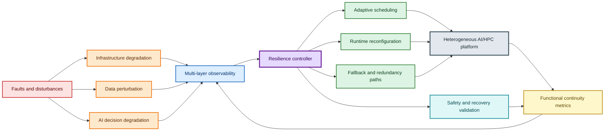

### Functional Service Model

Let $\mathcal{F} = \{f_1, f_2, \ldots, f_K\}$ be the set of essential
functions delivered by the platform. A function may correspond to a distributed
training phase, an inference service, a workflow stage, a simulation component,
a scheduler function, or a data-processing pipeline.

Each function $f_k$ is associated with a set of supporting components:

$$
\mathcal{V}_k \subseteq \mathcal{V}.
$$

The operational quality of function $f_k$ is modeled by:

$$
Q_k(t)
=
\Phi_k
\left(
\operatorname*{collection}_{v \in \mathcal{V}_k}
\mathbf{x}_v(t),
\;
\mathbf{d}(t)
\right).
$$

where $\Phi_k(\cdot)$ is a function-specific quality model and
$\mathbf{d}(t)$ represents the active disturbance state.

The normalized functional continuity of $f_k$ is:

$$
C_k(t)
=
\frac{Q_k(t)}
{Q_k^{\mathrm{nominal}}}
,
\qquad
0 \leq C_k(t) \leq 1.
$$

where $Q_k^{\mathrm{nominal}}$ is the expected quality under nominal
conditions.

A function is considered operational when its continuity remains above a
minimum acceptable threshold:

$$
C_k(t) \geq \tau_k,
$$

where $\tau_k \in [0,1]$ is the function-specific service threshold.

This formulation distinguishes functional resilience from simple restart
capability: a system may lose individual components while still preserving the
essential function $f_k$ through redundancy, degraded execution modes, or
validated fallback paths.

### Failure Domains and Blast Radius

Let $\mathcal{F}_d \subseteq \mathcal{V}$ denote a failure domain, i.e., a set
of components that may be jointly affected by a common failure cause such as a
power event, network partition, storage failure, software defect, or corrupted
data source.

For a fault event $e$ occurring at time $t_e$, let
$\mathcal{A}(e) \subseteq \mathcal{V}$ be the set of affected components.
The normalized blast radius is defined as:

$$
B(e)
=
\frac{
\sum_{v \in \mathcal{A}(e)} w_v
}{
\sum_{v \in \mathcal{V}} w_v
},
$$

where $w_v \geq 0$ is the criticality weight of component $v$.

A functional blast radius can also be defined as:

$$
B_{\mathcal{F}}(e)
=
\frac{
\sum_{k=1}^{K}
\omega_k
\mathbb{I}
\left[
C_k(t_e^{+}) < \tau_k
\right]
}{
\sum_{k=1}^{K} \omega_k
},
$$

where $\omega_k$ is the criticality of function $f_k$,
$t_e^{+}$ denotes the state immediately after the disturbance, and
$\mathbb{I}[\cdot]$ is the indicator function.

The objective of failure-domain isolation is to minimize both component-level
and function-level blast radii:

$$
\min B(e),
\qquad
\min B_{\mathcal{F}}(e).
$$

### Redundancy and Validated Fallback Paths

For each essential function $f_k$, let $\mathcal{P}_k$ be the set of
candidate execution paths. A path may use different compute resources, data
replicas, model replicas, communication routes, or reduced-capability service
modes.

The availability of execution path $p \in \mathcal{P}_k$ is:

$$
A_{k,p}(t)
=
\prod_{v \in p} a_v(t).
$$

If the function can be executed through at least one valid independent path,
its path-level availability is:

$$
A_k^{\mathrm{path}}(t)
=
1 -
\prod_{p \in \mathcal{P}_k}
\left(
1 - A_{k,p}(t)
\right).
$$

However, availability alone is insufficient. A fallback path must also satisfy
correctness, integrity, quality, and safety constraints. Let the validation
vector of path $p$ be:

$$
\mathbf{z}_{k,p}(t)
=
\left[
I_{k,p}(t),
R_{k,p}(t),
Q_{k,p}(t),
S_{k,p}(t)
\right],
$$

where:

- $I_{k,p}(t)$ is the data and state integrity score
- $R_{k,p}(t)$ is the correctness or reproducibility score
- $Q_{k,p}(t)$ is the output quality score
- $S_{k,p}(t)$ is the safety score

A fallback path is accepted only if:

$$
I_{k,p}(t) \geq \tau_I,
\qquad
R_{k,p}(t) \geq \tau_R,
\qquad
Q_{k,p}(t) \geq \tau_Q,
\qquad
S_{k,p}(t) \geq \tau_S.
$$

The set of validated paths is therefore:

$$
\mathcal{P}_k^{\mathrm{valid}}(t)
=
\left\{
p \in \mathcal{P}_k
\;\middle|\;
I_{k,p} \geq \tau_I,
\;
R_{k,p} \geq \tau_R,
\;
Q_{k,p} \geq \tau_Q,
\;
S_{k,p} \geq \tau_S
\right\}.
$$

A function has safe continuity when at least one validated execution path is
available:

$$
\exists p \in \mathcal{P}_k^{\mathrm{valid}}(t)
\quad \text{such that} \quad
A_{k,p}(t) > 0.
$$

### Adaptive Scheduling and Reconfiguration

Let $\mathcal{J}(t)$ be the set of active jobs, workflows, or inference
requests at time $t$, and let $\mathcal{R}(t)$ be the set of available
heterogeneous resources.

For each job $j \in \mathcal{J}(t)$, define the scheduling decision:

$$
x_{jr}(t)
=
\begin{cases}
1, & \text{if job } j \text{ is assigned to resource } r, \\
0, & \text{otherwise.}
\end{cases}
$$

Each resource $r$ has capacity $C_r(t)$, memory $M_r(t)$, and an availability
state $a_r(t)$. The allocation must satisfy:

$$
\sum_{r \in \mathcal{R}(t)}
x_{jr}(t)
\leq 1,
\qquad
\forall j \in \mathcal{J}(t),
$$

$$
\sum_{j \in \mathcal{J}(t)}
c_j x_{jr}(t)
\leq C_r(t),
\qquad
\forall r \in \mathcal{R}(t),
$$

$$
\sum_{j \in \mathcal{J}(t)}
m_j x_{jr}(t)
\leq M_r(t),
\qquad
\forall r \in \mathcal{R}(t),
$$

$$
x_{jr}(t) = 0
\qquad
\text{if}
\qquad
a_r(t) < \tau_{\mathrm{avail}}.
$$

where $c_j$ and $m_j$ are the compute and memory requirements of job $j$,
respectively.

The resilience-aware controller selects a scheduling and reconfiguration action
$\mathbf{u}(t)$ that minimizes a weighted operational risk:

$$
\mathbf{u}^{\star}(t)
=
\arg\min_{\mathbf{u}(t)}
\left[
\alpha \, L_{\mathrm{service}}(t)
+
\beta \, B_{\mathcal{F}}(t)
+
\gamma \, T_{\mathrm{recovery}}(t)
+
\delta \, R_{\mathrm{safety}}(t)
+
\epsilon \, O_{\mathrm{runtime}}(t)
\right],
$$

where:

- $L_{\mathrm{service}}(t)$ measures loss of functional service
- $B_{\mathcal{F}}(t)$ measures the functional blast radius
- $T_{\mathrm{recovery}}(t)$ measures recovery duration
- $R_{\mathrm{safety}}(t)$ measures residual correctness, integrity, or safety risk
- $O_{\mathrm{runtime}}(t)$ measures resilience overhead
- $\alpha, \beta, \gamma, \delta, \epsilon \geq 0$ are design weights

Possible actions include job migration, workload reprioritization, degraded
execution modes, resource quarantine, data-source switching, model fallback,
checkpoint restoration, replica activation, and network-path reconfiguration.

### Safe and Verified Recovery

Let $t_d$ be the disturbance detection time and $t_r$ be the time at which
the system resumes operation. Recovery is considered *safe and verified* only
when the service is restored and all validation requirements are met.

The safe recovery time is:

$$
T_{\mathrm{safe}}
=
t_{\mathrm{verified}} - t_d,
$$

where $t_{\mathrm{verified}}$ is the earliest time satisfying:

$$
C_k(t_{\mathrm{verified}}) \geq \tau_k,
$$

$$
I_k(t_{\mathrm{verified}}) \geq \tau_I,
\qquad
R_k(t_{\mathrm{verified}}) \geq \tau_R,
$$

$$
Q_k(t_{\mathrm{verified}}) \geq \tau_Q,
\qquad
S_k(t_{\mathrm{verified}}) \geq \tau_S.
$$

Thus, a restarted service is not automatically considered recovered. It must
first demonstrate functional continuity and satisfy integrity, correctness,
quality, and safety validation criteria.

### Resilience Metrics

The detection time is:

$$
T_{\mathrm{detect}}
=
t_d - t_e,
$$

where $t_e$ is the fault occurrence time.

The recovery time is:

$$
T_{\mathrm{recover}}
=
t_r - t_d.
$$

The safe recovery time is:

$$
T_{\mathrm{safe}}
=
t_{\mathrm{verified}} - t_d.
$$

The average functional continuity over an observation interval
$[t_0, t_1]$ is:

$$
\overline{C}_k
=
\frac{1}{t_1 - t_0}
\int_{t_0}^{t_1}
C_k(t)\,dt.
$$

The weighted platform-level functional continuity is:

$$
C_{\mathrm{global}}(t)
=
\frac{
\sum_{k=1}^{K}
\omega_k C_k(t)
}{
\sum_{k=1}^{K} \omega_k
}.
$$

The post-recovery correctness is:

$$
R_{\mathrm{post}}
=
\frac{
N_{\mathrm{correct}}
}{
N_{\mathrm{validated}}
},
$$

where $N_{\mathrm{correct}}$ is the number of validated outputs satisfying the correctness criterion and $N_{\mathrm{validated}}$ is the number of outputs assessed after recovery.

The relative resilience overhead is:

$$
O_{\mathrm{res}}
=
\frac{
T_{\mathrm{resilient}} - T_{\mathrm{baseline}}
}{
T_{\mathrm{baseline}}
}.
$$

where $T_{\mathrm{resilient}}$ is the execution time with resilience mechanisms enabled and $T_{\mathrm{baseline}}$ is the execution time of the reference system.

### Resilience Objective

The global objective is not merely to maximize component uptime. Instead, the framework maximizes verified functional utility under disturbances:

$$
\max_{\pi}
\;
\mathbb{E}
\left[
\int_{t_0}^{t_1}
C_{\mathrm{global}}(t)
\,dt
-
\lambda_1 B_{\mathcal{F}}(t)
-
\lambda_2 T_{\mathrm{safe}}(t)
-
\lambda_3 O_{\mathrm{res}}(t)
-
\lambda_4 R_{\mathrm{safety}}(t)
\right],
$$

where $\pi$ is the resilience policy controlling monitoring, scheduling, reconfiguration, redundancy activation, and recovery validation.

This objective formalizes the central principle of BioRes-AI/HPC: the system should remain operationally useful during disruption, limit the propagation of failures, and restore services only when recovery is demonstrably correct, safe, and trustworthy.

...

## For more information

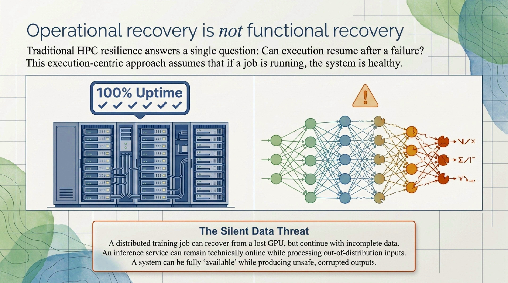
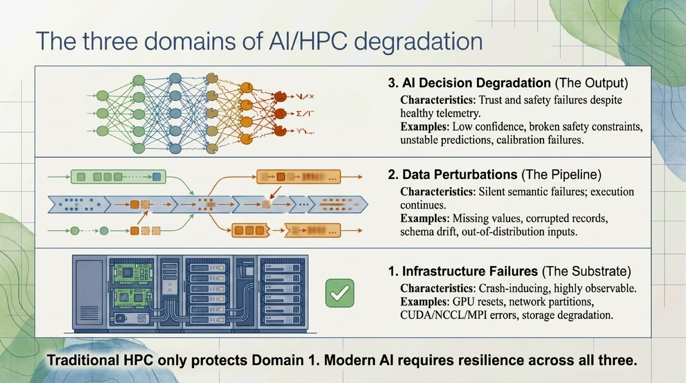

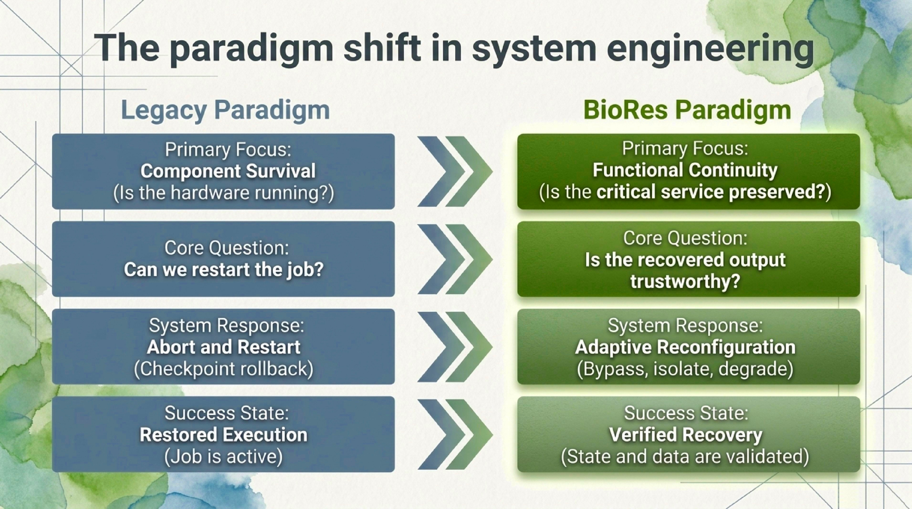
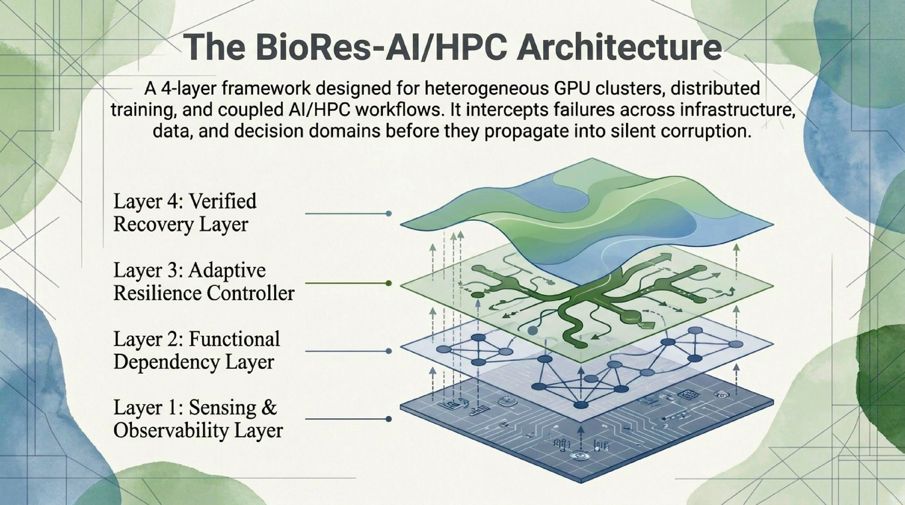
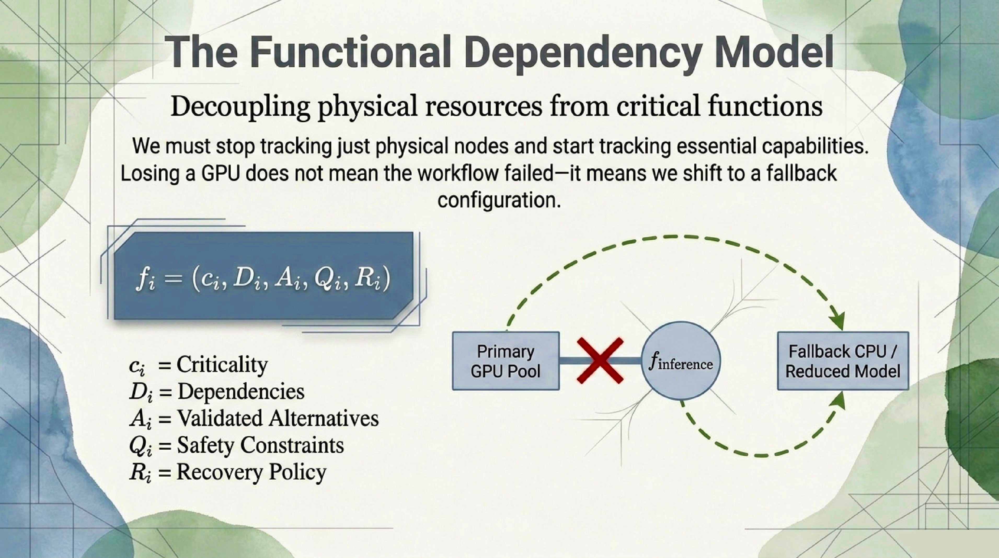
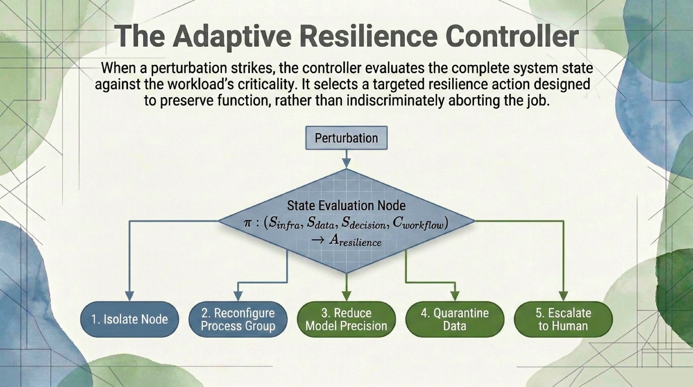
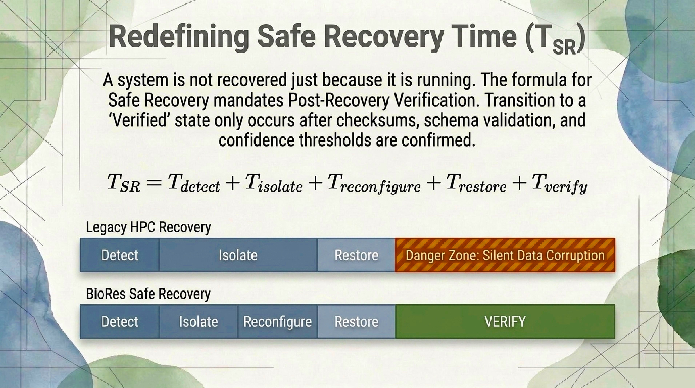
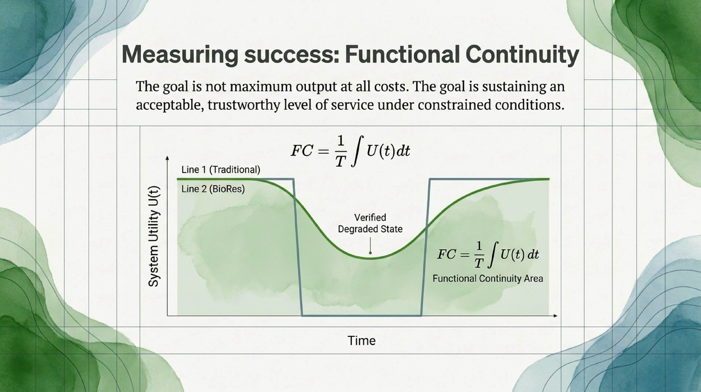
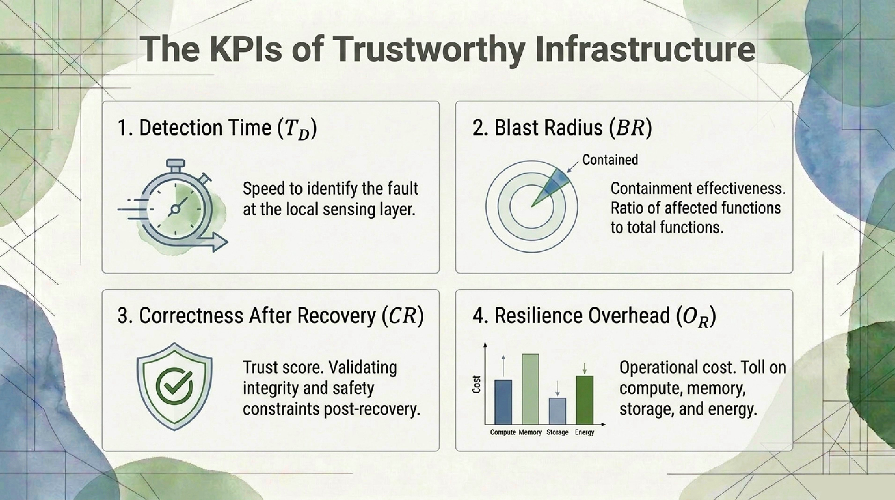
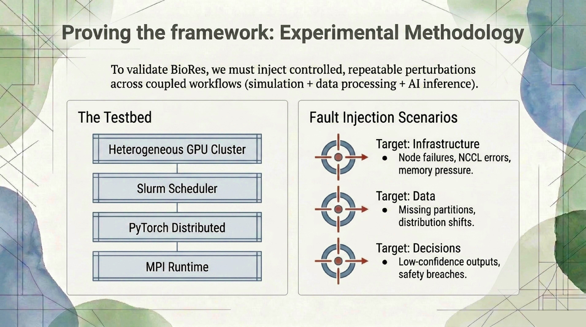
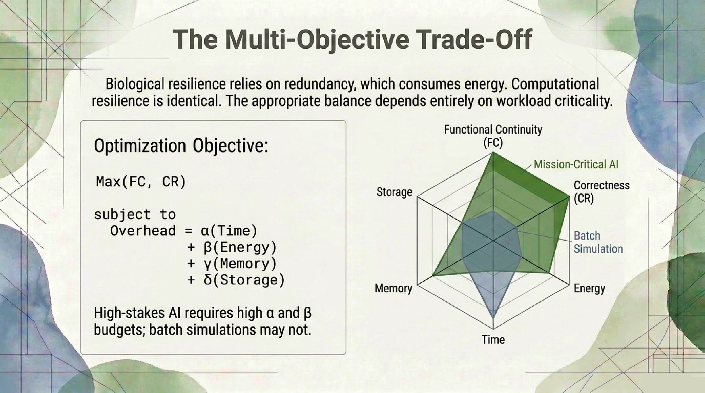
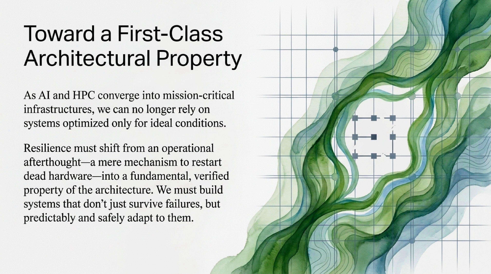

***
---

...

## Future Development

...

## 📝 **Author**

**Dr. Patrick Lemoine**  
*Engineer Expert in Scientific Computing*  
[LinkedIn](https://www.linkedin.com/in/patrick-lemoine-7ba11b72/)

---