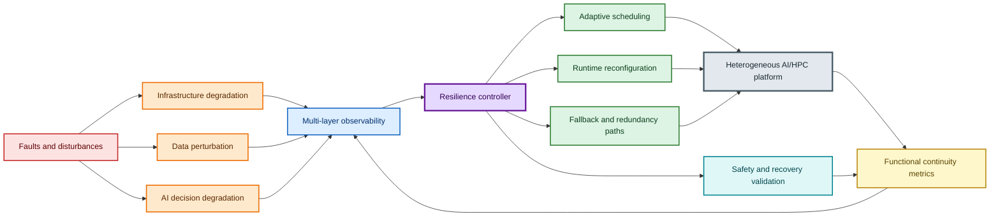
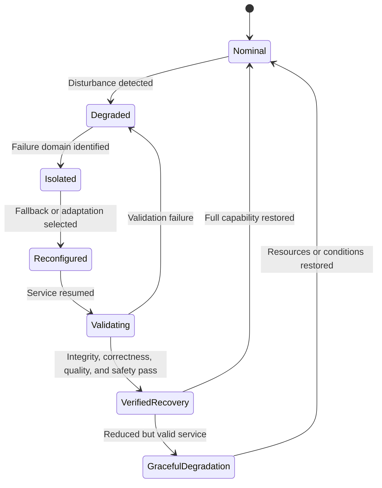

# BioRes-AI/HPC

*From Microbial Ecosystem Resilience to Adaptive AI/HPC Architectures: A Framework for Safe and Verified Functional Recovery*

---

---

**BioRes-AI/HPC** is a research framework for designing resilient Artificial Intelligence and High-Performance Computing infrastructures inspired by functional resilience in microbial ecosystems.

Rather than treating resilience solely as the ability to restart after a hardware or software failure, this work focuses on preserving essential system functions during disruption and verifying that recovery is correct, safe, and trustworthy. The framework addresses three interconnected degradation domains: infrastructure failures, data perturbations, and AI decision degradation.

It introduces a function-centric approach to resilience based on:

- Functional redundancy and validated fallback paths
- Failure-domain isolation and modular architecture
- Multi-layer observability across infrastructure, data, and AI outputs
- Adaptive scheduling and runtime reconfiguration
- Graceful degradation for critical services
- Safe and verified recovery through integrity, correctness, quality, and safety validation

The project is intended for heterogeneous GPU clusters, distributed AI training, inference services, coupled AI/HPC workflows, and fault-injection experiments. It provides a conceptual architecture, a mathematical formulation, resilience metrics, and an evaluation methodology. to measure detection time, blast radius, functional continuity, safe recovery time, post-recovery correctness, and operational overhead.

The broader objective is to move AI/HPC resilience beyond checkpoint/restart toward systems that remain useful, predictable, and verifiable under partial failures and uncertain operating conditions.

## Mathematical Formulation

### System Model

Let the AI/HPC platform be represented by a directed dependency graph:

$$
\mathcal G = (\mathcal V, \mathcal E).
$$

Here, $\mathcal V$ is the set of system components and $\mathcal E$ is the
set of dependency, communication, control, and data-flow edges.

A component $v \in \mathcal V$ may represent a compute node, GPU, network
link, storage service, scheduler, containerized service, data pipeline, model
instance, or monitoring component. Its local state is represented by:

$$
\mathbf x_v(t)
=
(a_v(t), c_v(t), m_v(t), q_v(t), s_v(t)).
$$

The variables have the following meanings:

- $a_v(t) \in [0,1]$: availability level
- $c_v(t) \in [0,1]$: available compute capacity
- $m_v(t) \in [0,1]$: available memory or storage capacity
- $q_v(t) \in [0,1]$: quality-of-service level
- $s_v(t) \in [0,1]$: safety and integrity confidence

The global platform state is the indexed family of component states:

$$
\mathbf X(t)
=
(\mathbf x_v(t))_{v \in \mathcal V}.
$$

The platform is exposed to three degradation domains:

$$
\mathcal D
=
(D_I, D_P, D_A).
$$

where $D_I$ denotes infrastructure degradation, $D_P$ denotes data
perturbation, and $D_A$ denotes AI decision degradation.

### Functional Service Model

Let $\mathcal F$ denote the collection of essential functions delivered by the
platform. A function $f_k$ may correspond to a distributed training phase, an
inference service, a workflow stage, a simulation component, a scheduling
function, or a data-processing pipeline.

Each function $f_k$ is supported by a subset $\mathcal V_k \subseteq \mathcal V$
of components.

For each function $f_k$, let $\mathbf X_k(t)$ denote the aggregated state of
its supporting components:

$$
\mathbf X_k(t)
=
\operatorname{aggregate}_{v \in \mathcal V_k}
\mathbf x_v(t).
$$

The operational quality of function $f_k$ is modeled by:

$$
Q_k(t)
=
\Phi_k(\mathbf X_k(t), \mathbf d(t)).
$$

Here, $\Phi_k$ is a function-specific quality model and $\mathbf d(t)$ is the
active disturbance state.

Let $Q_k^0$ denote the nominal quality of function $f_k$. Its normalized
functional continuity is:

$$
C_k(t)
=
\frac{Q_k(t)}{Q_k^0},
\qquad
0 \leq C_k(t) \leq 1.
$$

A function remains operational when:

$$
C_k(t) \geq \tau_k.
$$

The threshold $\tau_k \in [0,1]$ is the minimum acceptable continuity level for
function $f_k$.

This distinction is central to BioRes-AI/HPC: a system may lose individual
components while preserving an essential function through redundancy, degraded
execution modes, or validated fallback paths.

### Failure Domains and Blast Radius

Let $\mathcal F_d \subseteq \mathcal V$ be a failure domain: a group of
components that may be jointly affected by a common cause, such as a power
event, network partition, storage failure, software defect, or corrupted data
source.

For a fault event $e$ occurring at time $t_e$, let $\mathcal A(e)$ be the set
of affected components. The normalized component blast radius is:

$$
B(e)
=
\frac{
\sum_{v \in \mathcal A(e)} w_v
}{
\sum_{v \in \mathcal V} w_v
}.
$$

The parameter $w_v \geq 0$ is the criticality weight of component $v$.

Let $\omega_k$ be the criticality weight of function $f_k$. The functional
blast radius is:

$$
B_F(e)
=
\frac{
\sum_{k=1}^{K}
\omega_k
\mathbb I(C_k(t_e^+) < \tau_k)
}{
\sum_{k=1}^{K} \omega_k
}.
$$

Here, $t_e^+$ is the time immediately after the disturbance and $\mathbb I$
is the indicator function.

Failure-domain isolation aims to minimize both the component and functional
blast radii:

$$
\min B(e),
\qquad
\min B_F(e).
$$

### Redundancy and Validated Fallback Paths

For each essential function $f_k$, let $\mathcal P_k$ be the set of candidate
execution paths. A path may use alternate compute resources, data replicas,
model replicas, communication routes, or reduced-capability service modes.

For a path $p \in \mathcal P_k$, its availability is:

$$
A_{k,p}(t)
=
\prod_{v \in p} a_v(t).
$$

If at least one independent path is available, the path-level availability of
function $f_k$ is:

$$
A_k^{path}(t)
=
1
-
\prod_{p \in \mathcal P_k}
(1 - A_{k,p}(t)).
$$

Availability alone is insufficient. A fallback path must also satisfy
integrity, correctness, quality, and safety requirements. The validation state
of path $p$ is:

$$
\mathbf z_{k,p}(t)
=
(I_{k,p}(t), R_{k,p}(t), Q_{k,p}(t), S_{k,p}(t)).
$$

The validation variables are:

- $I_{k,p}(t)$: data and state integrity score
- $R_{k,p}(t)$: correctness or reproducibility score
- $Q_{k,p}(t)$: output quality score
- $S_{k,p}(t)$: safety score

A fallback path is accepted only when:

$$
I_{k,p}(t) \geq \tau_I,
\qquad
R_{k,p}(t) \geq \tau_R,
\qquad
Q_{k,p}(t) \geq \tau_Q,
\qquad
S_{k,p}(t) \geq \tau_S.
$$

A function has safe continuity when there exists at least one available path
that satisfies all validation constraints:

$$
\exists p \in \mathcal P_k
\quad
\text{such that}
\quad
A_{k,p}(t) > 0,
$$

$$
I_{k,p}(t) \geq \tau_I,
\qquad
R_{k,p}(t) \geq \tau_R,
$$

$$
Q_{k,p}(t) \geq \tau_Q,
\qquad
S_{k,p}(t) \geq \tau_S.
$$

### Adaptive Scheduling and Reconfiguration

Let $\mathcal J(t)$ be the set of active jobs, workflows, or inference
requests at time $t$. Let $\mathcal R(t)$ be the set of available
heterogeneous resources.

For a job $j$ and a resource $r$, the assignment decision is:

$$
x_{jr}(t)
=
\begin{matrix}
1, & \text{if job } j \text{ is assigned to resource } r, \\
0, & \text{otherwise.}
\end{matrix}
$$

Each resource $r$ has capacity $C_r(t)$, memory $M_r(t)$, and availability
$a_r(t)$. The allocation must satisfy:

$$
\sum_{r \in \mathcal R(t)}
x_{jr}(t)
\leq 1
\quad
\text{for every job } j.
$$

$$
\sum_{j \in \mathcal J(t)}
c_j x_{jr}(t)
\leq C_r(t)
\quad
\text{for every resource } r.
$$

$$
\sum_{j \in \mathcal J(t)}
m_j x_{jr}(t)
\leq M_r(t)
\quad
\text{for every resource } r.
$$

$$
x_{jr}(t)
=
0
\quad
\text{when}
\quad
a_r(t) < \tau_A.
$$

Here, $c_j$ and $m_j$ are the compute and memory requirements of job $j$, and
$\tau_A$ is the minimum resource availability threshold.

The resilience controller selects a scheduling and reconfiguration action
$\mathbf u(t)$ that minimizes weighted operational risk:

$$
\mathbf u^*(t)
=
\arg\min_{\mathbf u(t)}
\Big(
\alpha L_{service}(t)
+
\beta B_F(t)
+
\gamma T_{recovery}(t)
+
\delta R_{safety}(t)
+
\epsilon O_{runtime}(t)
\Big).
$$

The terms are:

- $L_{service}(t)$: loss of functional service
- $B_F(t)$: functional blast radius
- $T_{recovery}(t)$: recovery duration
- $R_{safety}(t)$: residual correctness, integrity, or safety risk
- $O_{runtime}(t)$: resilience runtime overhead
- $\alpha$, $\beta$, $\gamma$, $\delta$, and $\epsilon$: non-negative design weights

Possible actions include job migration, workload reprioritization, degraded
execution modes, resource quarantine, data-source switching, model fallback,
checkpoint restoration, replica activation, and network-path reconfiguration.

### Safe and Verified Recovery

Let $t_d$ be the disturbance detection time and $t_r$ be the time at which the
system resumes operation.

The safe recovery time is:

$$
T_{safe}
=
t_{verified}
-
t_d.
$$

Recovery is safe and verified only when functional continuity, integrity,
correctness, quality, and safety all satisfy their requirements:

$$
C_k(t_{verified}) \geq \tau_k.
$$

$$
I_k(t_{verified}) \geq \tau_I,
\qquad
R_k(t_{verified}) \geq \tau_R.
$$

$$
Q_k(t_{verified}) \geq \tau_Q,
\qquad
S_k(t_{verified}) \geq \tau_S.
$$

A restarted service is therefore not automatically considered recovered. It
must first demonstrate functional continuity and pass integrity, correctness,
quality, and safety validation.

### Resilience Metrics

The detection time is:

$$
T_{detect}
=
t_d
-
t_e.
$$

Here, $t_e$ is the fault occurrence time.

The recovery time is:

$$
T_{recover}
=
t_r
-
t_d.
$$

The safe recovery time is:

$$
T_{safe}
=
t_{verified}
-
t_d.
$$

The average functional continuity over the observation interval from $t_0$ to
$t_1$ is:

$$
\overline C_k
=
\frac{1}{t_1 - t_0}
\int_{t_0}^{t_1}
C_k(t)
\,dt.
$$

The weighted platform-level functional continuity is:

$$
C_{global}(t)
=
\frac{
\sum_{k=1}^{K}
\omega_k C_k(t)
}{
\sum_{k=1}^{K} \omega_k
}.
$$

The post-recovery correctness is:

$$
R_{post}
=
\frac{
N_{correct}
}{
N_{validated}
}.
$$

Here, $N_{correct}$ is the number of validated outputs satisfying the
correctness criterion and $N_{validated}$ is the number of outputs evaluated
after recovery.

The relative resilience overhead is:

$$
O_{res}
=
\frac{
T_{resilient}
-
T_{baseline}
}{
T_{baseline}
}.
$$

Here, $T_{resilient}$ is the execution time with resilience mechanisms enabled
and $T_{baseline}$ is the execution time of the reference system.

### Resilience Objective

The global objective is not merely to maximize component uptime. The framework
instead maximizes verified functional utility under disturbances:

$$
\max_{\pi}
\;
\mathbb E
\Big(
\int_{t_0}^{t_1}
C_{global}(t)
\,dt
-
\lambda_1 B_F(t)
-
\lambda_2 T_{safe}(t)
-
\lambda_3 O_{res}(t)
-
\lambda_4 R_{safety}(t)
\Big).
$$

The policy $\pi$ controls monitoring, scheduling, reconfiguration, redundancy
activation, and recovery validation.

This objective formalizes the central principle of BioRes-AI/HPC: the platform
should remain operationally useful during disruption, limit failure
propagation, and restore services only when recovery is demonstrably correct,
safe, and trustworthy.

...

## For more information

***
---

...

## Future Development

...

## 📝 **Author**

**Dr. Patrick Lemoine**  
*Engineer Expert in Scientific Computing*  
[LinkedIn](https://www.linkedin.com/in/patrick-lemoine-7ba11b72/)

---